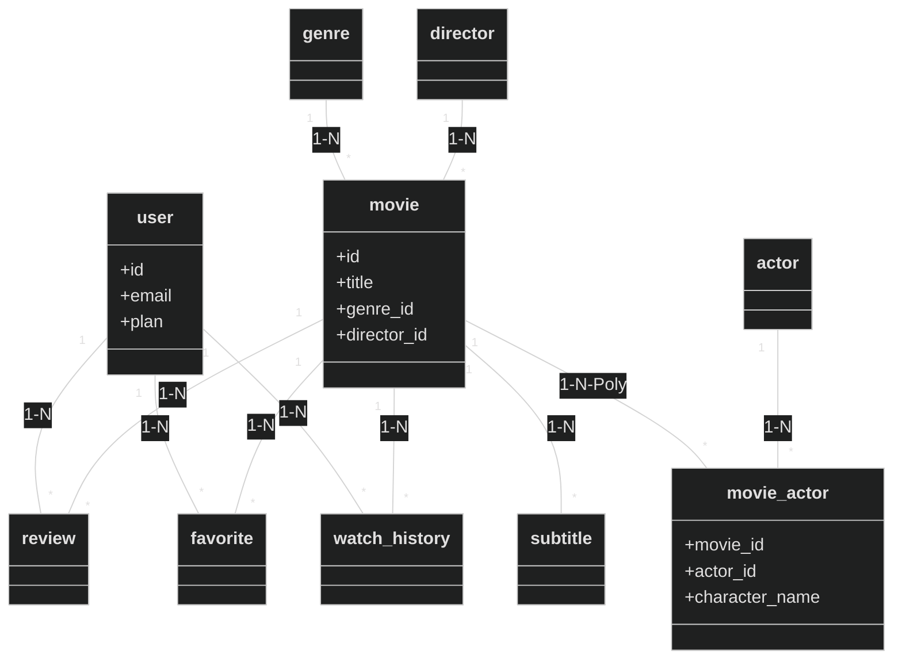

# Rules class

> Este archivo no debe ser modificado por ti.
> Directrices para diseño de esquemas de base de datos.
> Compatible con **PostgreSQL** (Simulado con JSON Server)
> Recuerda que eres el mejor senior en regla de clases ingeniero nivel dios en practica.
> Recuerda que docs/rules/_\_.md son el corazón de todo el proyecto, de ahi sacaras toda la información para realizar todo estar 100% fiel a docs/rules/_\_.md

## 📝 Nomenclatura

| Regla               | Ejemplo                     |
| ------------------- | --------------------------- |
| Usar `snake_case`   | `movie_id`, `poster_url`    |
| No usar `camelCase` | ~~`movieId`~~, ~~`userId`~~ |
| Tablas en singular  | `user`, `movie`, `genre`    |
| FK con sufijo `_id` | `user_id`, `movie_id`       |

---

## 🗂️ Orden de Campos

### 1. PK primero

```sql
+id: int [PK]
```

### 2. Campos principales (más importantes)

```sql
+title: varchar[200](UQ)
+description: text
+name: varchar[100]
```

### 3. Agrupar por tipo

**Textos juntos:**

```sql
+email: varchar[100]
+username: varchar[100]
+password: varchar[100] -- Mock
+bio: text?
```

**URLs juntas:**

```sql
+poster_url: varchar[500]
+backdrop_url: varchar[500]
+video_url: varchar[500]
+trailer_url: varchar[500]
+avatar_url: varchar[500]
```

**Números juntos:**

```sql
+rating: decimal
+duration_minutes: int
+year: int
+views_count: int
+budget: decimal?
+revenue: decimal?
```

**Booleans juntos:**

```sql
+is_active: boolean
+is_featured: boolean
+is_original: boolean
+has_subtitles: boolean
```

**Fechas juntas (al final antes de FK):**

```sql
+release_date: date
+created_at: timestamp
+updated_at: timestamp
```

### 4. FK al final

```sql
+user_id: int [FK]
+movie_id: int [FK]
```

---

## 📊 Tipos de Datos (Simulados en JSON)

| Tipo        | Uso                                     |
| ----------- | --------------------------------------- |
| `int`       | IDs, contadores                         |
| `text[100]` | Nombres, emails                         |
| `text[500]` | URLs                                    |
| `decimal`   | Ratings, Money                          |
| `boolean`   | Flags                                   |
| `timestamp` | Fechas ISO 8601                         |
| `jsonb`     | Metadata flexible (specs, tech_details) |

---

## Core Entities

### user

```sql
class user {
    +id: int [PK]
    +name: varchar[100]
    +email: varchar[100](UQ)
    +password: varchar[100] -- Mock hash
    +avatar_url: varchar[500]?
    +role: enum -- 'ADMIN' | 'USER'
    +plan: enum -- 'FREE' | 'PREMIUM'
    +preferences: jsonb? -- { "dark_mode": true, "autoplay": false }
    +is_verified: boolean
    +created_at: timestamp
    +updated_at: timestamp
}
```

### movie

```sql
class movie {
    +id: int [PK]
    +title: varchar[200]
    +slug: varchar[200](UQ)
    +description: text
    +poster_url: varchar[500]
    +backdrop_url: varchar[500]?
    +video_url: varchar[500] -- Mock stream URL
    +trailer_url: varchar[500]?
    +year: int
    +duration_minutes: int
    +rating: decimal?
    +views_count: int
    +is_featured: boolean
    +is_original: boolean
    +release_date: date
    +created_at: timestamp
    +updated_at: timestamp
    +genre_id: int [FK]
    +director_id: int [FK]
}
```

### genre

```sql
class genre {
    +id: int [PK]
    +name: varchar[50](UQ)
    +slug: varchar[50](UQ)
    +icon_url: varchar[500]?
    +created_at: timestamp
    +updated_at: timestamp
}
```

### actor

```sql
class actor {
    +id: int [PK]
    +name: varchar[100]
    +bio: text?
    +photo_url: varchar[500]?
    +birth_date: date?
    +created_at: timestamp
    +updated_at: timestamp
}
```

### director

```sql
class director {
    +id: int [PK]
    +name: varchar[100]
    +bio: text?
    +photo_url: varchar[500]?
    +created_at: timestamp
    +updated_at: timestamp
}
```

### movie_actor (Pivot)

```sql
class movie_actor {
    +id: int [PK]
    +character_name: varchar[100]
    +movie_id: int [FK]
    +actor_id: int [FK]
}
```

### review

```sql
class review {
    +id: int [PK]
    +content: text
    +rating: int -- 1 to 5
    +likes_count: int
    +created_at: timestamp
    +updated_at: timestamp
    +user_id: int [FK]
    +movie_id: int [FK]
}
```

### favorite

```sql
class favorite {
    +id: int [PK]
    +created_at: timestamp
    +user_id: int [FK]
    +movie_id: int [FK]
}
```

### watch_history

```sql
class watch_history {
    +id: int [PK]
    +progress_seconds: int
    +is_completed: boolean
    +last_watched_at: timestamp
    +user_id: int [FK]
    +movie_id: int [FK]
}
```

### subtitle

```sql
class subtitle {
    +id: int [PK]
    +language: varchar[50] -- 'es', 'en', 'fr'
    +file_url: varchar[500] -- .vtt or .srt
    +movie_id: int [FK]
}
```

---

## 🔗 Relaciones



---

### Verificación de Clases (OBLIGATORIO)

#### user

- [x] rules-class.md, [x] nomenclatura, [x] orden de campos, [x] enums y tipos_datos, [x] json y nullable, [x] nomeclatura de relaciones

#### movie

- [x] rules-class.md, [x] nomenclatura, [x] orden de campos, [x] enums y tipos_datos, [x] json y nullable, [x] nomeclatura de relaciones

#### genre

- [x] rules-class.md, [x] nomenclatura, [x] orden de campos, [x] enums y tipos_datos, [x] json y nullable, [x] nomeclatura de relaciones

#### actor

- [x] rules-class.md, [x] nomenclatura, [x] orden de campos, [x] enums y tipos_datos, [x] json y nullable, [x] nomeclatura de relaciones

#### director

- [x] rules-class.md, [x] nomenclatura, [x] orden de campos, [x] enums y tipos_datos, [x] json y nullable, [x] nomeclatura de relaciones

#### review

- [x] rules-class.md, [x] nomenclatura, [x] orden de campos, [x] enums y tipos_datos, [x] json y nullable, [x] nomeclatura de relaciones

#### favorite

- [x] rules-class.md, [x] nomenclatura, [x] orden de campos, [x] enums y tipos_datos, [x] json y nullable, [x] nomeclatura de relaciones

#### watch_history

- [x] rules-class.md, [x] nomenclatura, [x] orden de campos, [x] enums y tipos_datos, [x] json y nullable, [x] nomeclatura de relaciones

#### subtitle

- [x] rules-class.md, [x] nomenclatura, [x] orden de campos, [x] enums y tipos_datos, [x] json y nullable, [x] nomeclatura de relaciones
